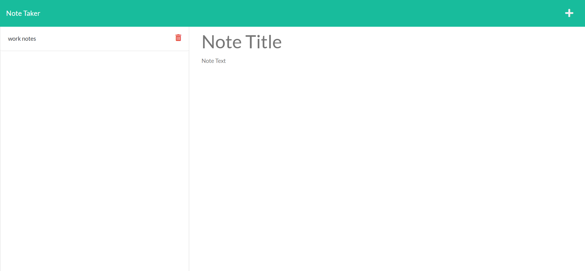
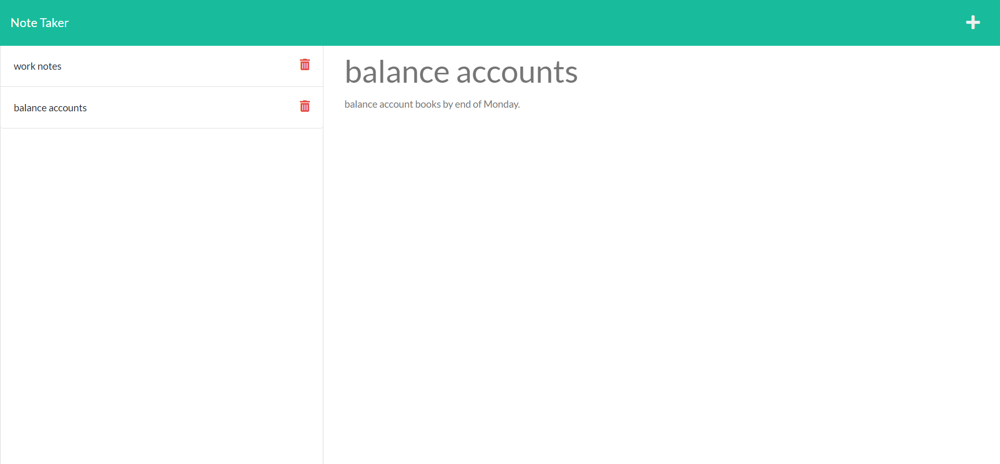

# note-taker

## purpose of app

- i designed this application so that people could see current and future weather conditions for any city so they could
  plan ahead for holidays, journeys or trips in advance without being taken by suprise by unprecedented weather conditions.

## user journey :

- GIVEN a note-taking application
- When user open the Note Taker
  Then they are presented with a landing page with a link to a notes page
- When the user clicks on the link to the notes page then they are presented with a page with existing notes listed in the left-hand column,
  plus empty fields to enter a new note title and the note’s text in the right-hand column
- When the user enters a new note title and the note’s text, then a Save icon appears in the navigation at the top of the page.
- When user clicks on the Save icon Then the new note they have entered is saved and appears in the left-hand column with the other existing notes
- When the user clicks on an existing note in the list in the left-hand column, then that note appears in the right-hand column.
- When the user clicks on the plus icon in the navigation at the top of the page, then they are presented with empty fields to enter a new note title and the note’s text in the right-hand column.

## My links

-github url: [https://github.com/abdinasir1993/note-taker/tree/dev](https://github.com/abdinasir1993/note-taker/tree/dev)

-deployed url:[https://note-taker-app1993.herokuapp.com/](https://note-taker-app1993.herokuapp.com/)

## Mock-Ups

